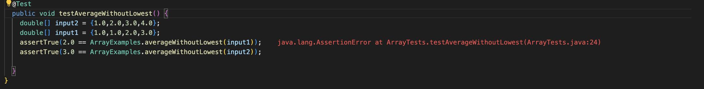

# Part One


Once localhost is accessed by the user, `HandleRequest()` within our StringServer.java file is called, with the URL passed directly to this method. From there, `HandleRequest()` checks to see if the user is requesting the root path (i.e `localhost:port/`), and if so returns the current text held within the variable `completeText`, which by default is empty. If the user is not accessing the root path, the method then checks if the user is requesting the path `/add-message`, and if so checks if the query (`?s=texthere`) is present and correct. If so, the method adds the text immediately following the `=` in the query to the `completeText` variable, printing out its current contents.

For all other paths other than those listed above, the method will output `404 Page Not Found`.

In the case shown above, as `/add-message` is called with the following query `?s=Message One`, the method will add "Message One" to the variable `completeText`, the returning this variable and outputting its contents to the page.


The same method of `HandleRequest()` is called, just as the previous example. However, unlike the previous example, the variable `completeText` already contains "Message One", and as such this is displayed when requesting either the root path or `/add-message`. When `add-message?s=Message Two` is requested, as shown in the example above, `HandleRequest()` checks the path, then the query, and adds "Message Two" to the `completeText` variable, then outputting to the page.

# Part Two

Failure Inducing Input:

```
  public void testAverageWithoutLowest() {
    double[] input1 = {1.0,1.0,2.0,3.0};
    assertTrue( 2.0 == ArrayExamples.averageWithoutLowest(input1));
  }
```

This test will induce failure, due to the following buggy code: 

```
  static double averageWithoutLowest(double[] arr) {
    if(arr.length < 2) { return 0.0; }
    double lowest = arr[0];
    for(double num: arr) {
      if(num < lowest) { lowest = num; }
    }
    double sum = 0;
    for(double num: arr) {
      if(num != lowest) { sum += num; }
    }
    return sum / (arr.length - 1);
  }
```

Although the code still contains bugs, the following test will not induce failure:

```
  public void testAverageWithoutLowest() {
    double[] input2 = {1.0,2.0,3.0,4.0};
    assertTrue(3.0 == ArrayExamples.averageWithoutLowest(input2));
  }
```



Broken Code:

```
  static double averageWithoutLowest(double[] arr) {
    if(arr.length < 2) { return 0.0; }
    double lowest = arr[0];
    for(double num: arr) {
      if(num < lowest) { lowest = num; }
    }
    double sum = 0;
    for(double num: arr) {
      if(num != lowest) { sum += num; }
    }
    return sum / (arr.length - 1);
  }
```

Fixed Code:

```
  static double averageWithoutLowest(double[] arr) {
    if(arr.length < 2) { return 0.0; }
    double lowest = arr[0];
    for(double num: arr) {
      if(num < lowest) { lowest = num; }
    }
    double sum = 0;
    for(double num: arr) {
       sum += num;
    }
    return (sum - lowest) / (arr.length - 1);
  }
```

This fix focuses on the issue in the original code in that, rather than simply removing the lowest value and then computing the averge, the code would remove each element that equals the lowest value. So, when given a list that contains the lowest value twice, it would remove both instances, rather than just one.

To fix this issue, we simply sum all elements, and then remove the lowest value right before computing the average.

# Part 3

One thing that I learned from the lab in week 2 was the intuitions behind how web servers work. While I have used websites for a large portion of my life, my understanding of the mechanics which allow them to run was still rather basic. Through this lab, I was able to refine my understandings of how requests work, and how a server parses requests.

