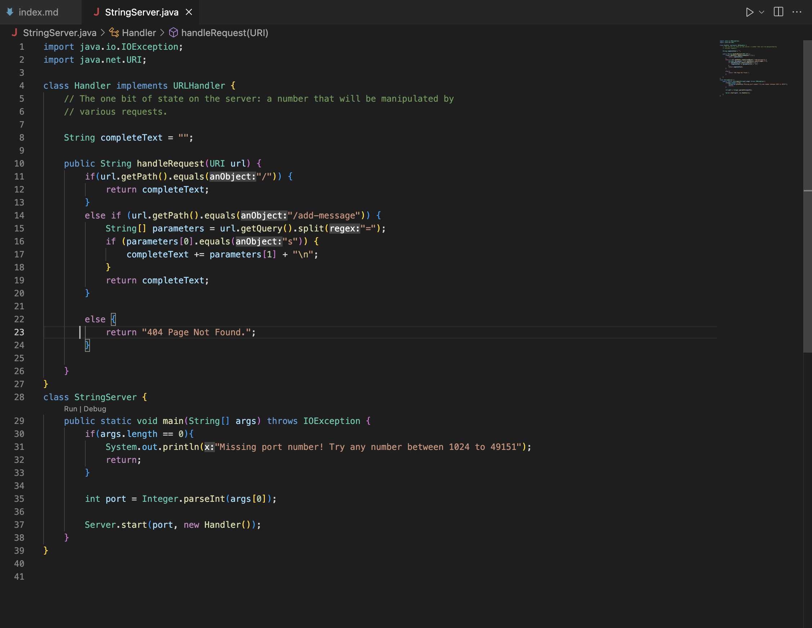
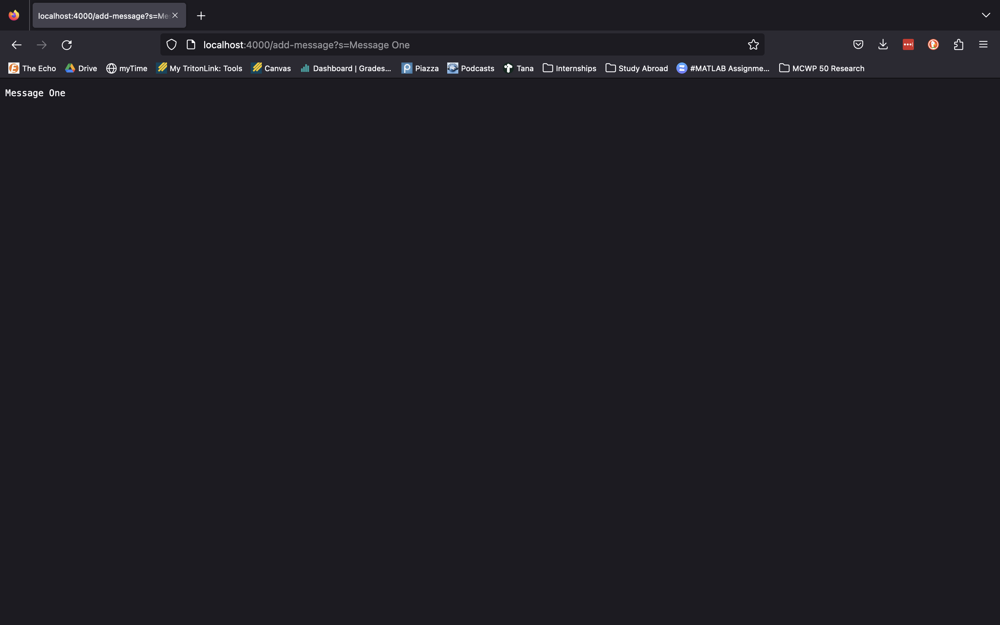
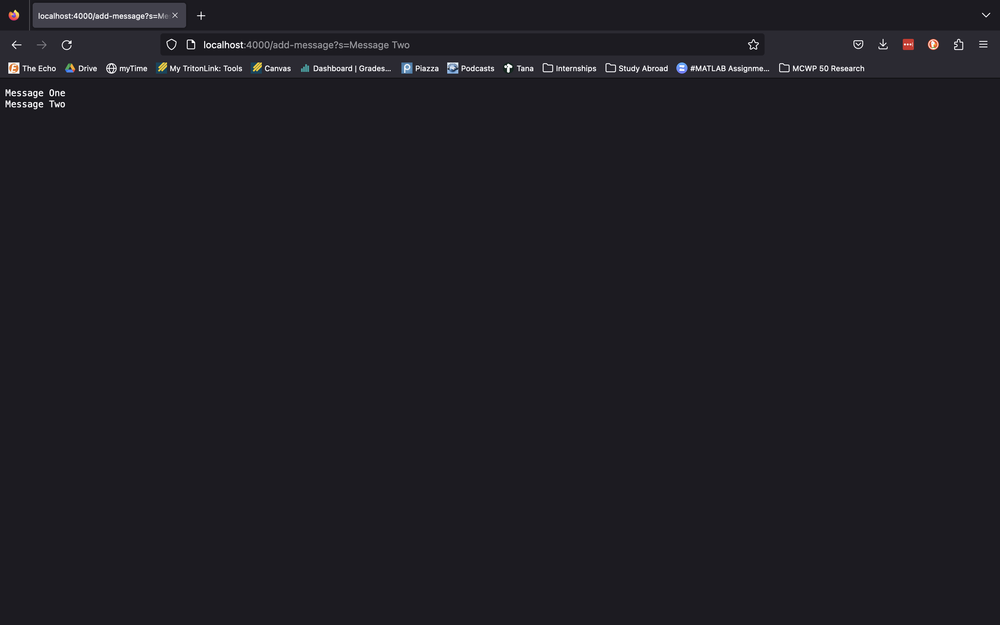

Once localhost is accessed by the user, HandleRequest() within our StringServer.java file is called, with the URL passed directly to this method. From there, HandleRequest() checks to see if the user is requesting the root path (i.e `localhost:port/`), and if so returns the current text held within the variable `completeText`, which by default is empty. If the user is not accessing the root path, the method then checks if the user is requesting the path `/add-message`, and if so checks if the query (`?s=texthere`) is present and correct. If so, the method adds the text immediately following the `=` in the query to the `completeText` variable, printing out its current contents.

For all other paths other than those listed above, the method will output `404 Page Not Found`.

